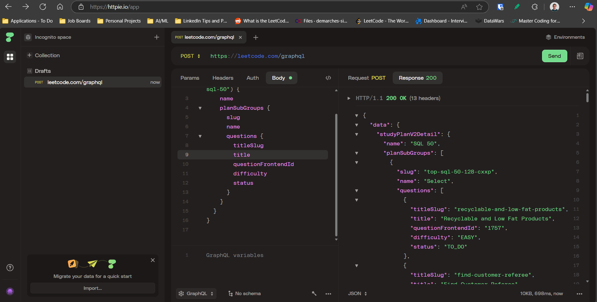

Install Plawright with the Pytest plugin:

```
pip install pytest-playwright
```

Install the required browsers:

```
playwright install
```


```
$env:PWDEBUG=1
```

```
query GetSQL50StudyPlan {
  studyPlanV2Detail(planSlug: "top-sql-50") {
    name
    planSubGroups {
      slug
      name
      questions {
        titleSlug
        title
        questionFrontendId
        difficulty
        status
      }
    }
  }
}

```


```
query selectProblem {
    question(titleSlug: "recyclable-and-low-fat-products") {
        questionId
        questionFrontendId
        boundTopicId
        title
        titleSlug
        content
        translatedTitle
        translatedContent
        isPaidOnly
        difficulty
        likes
        dislikes
        isLiked
        similarQuestions
        exampleTestcases
        contributors {
            username
            profileUrl
            avatarUrl
        }
        topicTags {
            name
            slug
            translatedName
        }
        companyTagStats
        codeSnippets {
            lang
            langSlug
            code
        }
        stats
        hints
        solution {
            id
            canSeeDetail
            paidOnly
            hasVideoSolution
            paidOnlyVideo
        }
        status
        sampleTestCase
        metaData
        judgerAvailable
        judgeType
        mysqlSchemas
        enableRunCode
        enableTestMode
        enableDebugger
        envInfo
        libraryUrl
        adminUrl
        challengeQuestion {
            id
            date
            incompleteChallengeCount
            streakCount
            type
        }
        note
    }
}
```



1. GraphQL query the study plan to create folders and files (with id, title, difficulty)
2. GraphQL query the questions using the titleSlug of questionss from previous query, fill the markdown files
3. Go to list of submissions (see `submissions.json`) 
4. ? get the accepted solution with the fastest runtime > latest date
5. Use the id to get code and runtime

```
query GetSubmission {
submissionDetails(submissionId:1458151796){
    memory
    runtimeDisplay
    code
  }
}

```


