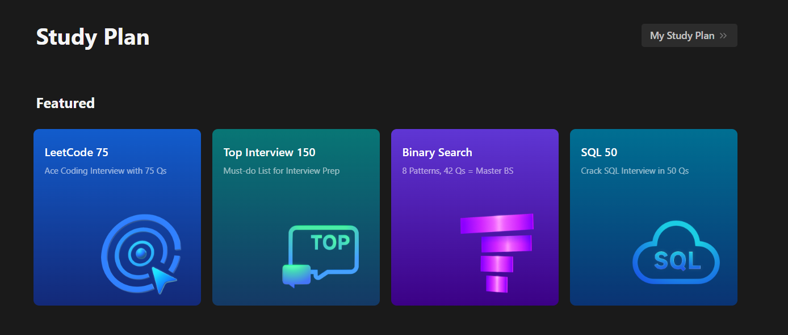

# LeetCode Markdown Builder

This project is a command-line tool designed to fetch study plans from LeetCode, including exercises and your solutions, and save the information in Markdown files so they can be documented and hosted on your GitHub profile for easy reference. The tool leverages LeetCode's GraphQL API, which was reverse-engineered from the website to extract the necessary data.



## Getting Started

### Prerequisites

- Python 3.9+
- pip for package installation

### Setup

1. Clone or download this repository
2. Navigate into the project directory
   ```sh
   cd LeetCodeMD-builder
   ```
3. (Optional) Set up a virtual environment
    ```sh
    virtualenv env
    ```
    ```sh
    .\env\Scripts\activate
    ```

4. Install the required Python packages
    ```sh
    pip install -r requirements.txt

5. Add your LeetCode cookie
   1. Login to LeetCode on your browser
   2. After logging in, right-click on the page and press `Inspect`
   3. Refresh the page
   4. Look for a network request to https://leetcode.com
   5. Look under Request Headers for the `cookie:` attribute and copy its value
   6. Create a `.env` file in the project root directory with your LeetCode cookie:
    ```
    LEETCODE_COOKIE='<your_cookie_here>'
    ```

## Usage

Run the tool using the following command:
```sh
python ./src/main.py -u <STUDY_PLAN_URL> -o <OUTPUT_FOLDER>
```

- `-u`: The URL of the LeetCode study plan (e.g., https://leetcode.com/studyplan/top-sql-50/)
- `-o`: The path to the folder where the files should be saved


## Roadmap

- [x] Add command-line arguments
- [ ] Cleanup and refactoring
- [ ] Display medal in README if the study plan is completed
- [ ] Display stats in README (percent completed, by difficulty, etc)
- [ ] Parallelize file writing
- [ ] Optimize GraphQL queries

## Contributing
Contributions are welcome! Please fork the repository and submit a pull request for any improvements or bug fixes.

## License

This project is licensed under the MIT License. See the [LICENSE](./LICENSE) file for details.